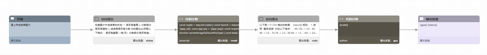

# gpa-calculator

#### 介绍
上传学生成绩单图片，可自动OCR识别图表，并计算点绩（GPA）

#### 煎蛋智能体流程

#### 使用说明
**注意**：本智能体使用到了WPS表格识别API （https://solution.wps.cn/docs/convert/img-to-docs.html），请前往WPS开放平台获取对应的app_id 和 app_key，并填入开始节点对应的环境变量里。

1. 创建任意煎蛋智能体
2. 点击进入智能体编辑界面
3. 点击源代码 -> 导入
4. 选择文件agent.gen，完整煎蛋流程即可导入。
5. 点击设置，多模态选项里勾上 "图片"
6. 保存设置
7. 点击编辑流程，点击开始节点，填入你的WPS app_id 和 app_key
8. 点击调试按钮，上传成绩单图片，即可自动计算点绩。

#### 注册煎蛋账号

1.  访问https://gendial.cn
2.  与右下角的煎蛋对话获取测试账号
